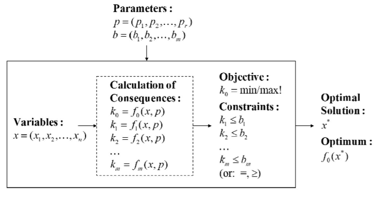

# Formulierung eines Optimierungsproblems

Zur Erstellung von Deskriptiven Modellen (oder auch Evaluationsmodellen) müsen 5 Domänen definiert werden.

Sets:
    Problemdomäne (z.B. Standorte einer Autovermietfirma).
Parameter:
    Diese kann der Algorithmus nicht verändern, sie sind durch das Problem gegeben (z.B. wie viele Fahrzeuge am Standort x vorhanden sind).

Variablen:
    Durch einen Algorithmus veränderbare Variablen (z.B. wie viele Autos von a nach b transferiert werden müssen).

Constraints:
    Welche Beschränkungen für ein Modell gelten.

Objective Function:
    Die Funktion, welche optimiert werden soll (z.b. minimiere die Anzahl zu fahrende Kilometer).

\newpage