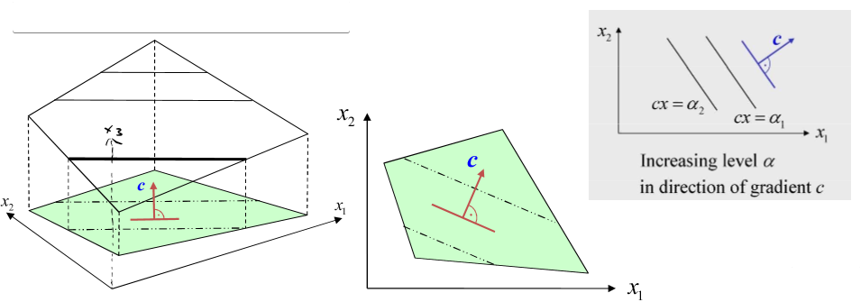

# Level Sets zeichnen

Für eine Funktion $\mathcal{f}: \mathbb{R} \rightarrow \mathbb{R}$ with $\mathcal{f}(\vec{x})=\vec{c}^{T}\vec{x}$, $\vec{c}=(c_{1},c_{2})$ und einem Level Set $\alpha$

1. Konvertiere zu einer Linearen Funktion:
   - max: $x_{2} =  c_{1}x_{1}+c_{2}$
   - min: $x_{2} =  -c_{1}x_{1}-c_{2}$
2. Setzte Werte für $x_{1}$ ein. (Am besten, berechne einen Punkt wo $x_{1} = 0$ and $x_{2}=0$).

Für höhere Dimensionen muss entsprechend angepasst werden, z.B. für 3 Dimensionen, konstruiere eine Ebenengleichung statt einer Geradengleichung.

