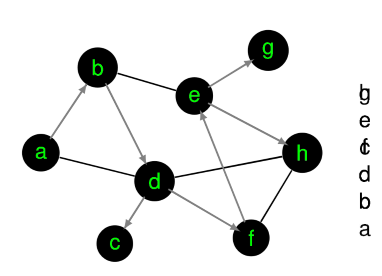

# Graph Traversing

Algorithmus, welcher alle Knoten in einem Graphen besucht, wobei er zuerst in die Tiefe geht.

## Depth First

Für einen gegebenen Graphen $G$, wähle einen Startknoten $x$ aus.

1. Lege $x$ auf den Stack
2. Aus allen Nachbarsknoten von $x$, wählen einen beliebigen Knoten $y$ aus welcher noch nicht auf dem Stack ist.
3. Setzte $x := y$
4. Hat der aktuelle Knoten keine Nachbarsknoten, welche noch nicht im Stack sind, gehen zum letzten Knoten zurück.

## Beadth First Search

Für einen gegebenen Graphen G, wähle einen Startknoten x und lege diesen in eine FIFO-Queue

1. Entferne das vorderste Element x aus der Queue
2. Füge alle Nachbaren von x in die Queue ein.
3. Schreibe x in den Output
4. Gehe zu 1.

