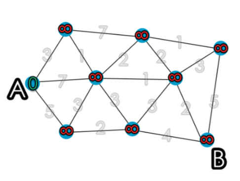

# Dijkstra's Algorithm

Berechnet den kürzesten Pfad eines Knoten $v_{s}$ zu allen anderen Knoten. Wir berechnen iterativ die kürzeste Distanz $I(v)$ für den Vertex $v$, der am nächsten zu $v_{s}$ ist.

## Algorithmus

Start:
    Setze $V_{0} = V, E_{0} = \emptyset, I(v_{s}) = 0$. Setzte alle anderen Distanzen auf $\infty$

Führe folgendes $n-1$ mal aus:

1. Ist V_{0} nocht nicht leer, wähle aus $V_{0}$ den Knoten $v_{i}$ mit der kleinsten Kantenlänge zu $v_{s}$ aus, welcher von $V_{0}$ erreichbar ist.
   1. In der ersten Iteration wird das zwingend $v_{s}$ selbst sein, da wir die Distanz $I(v_{s}) = 0$ gesetzt haben. Alle anderen haben Distanz $\infty$
2. Füge die Distanz des Knoten $v_{i}$ in die Distanztabelle ein.

Starte mit der folgenden Tabelle um die Distanzen zu rechnen:

|   s/t   | $v_{s} | $v_{1}$  | $v_{2}$  | $\dots$ | $v_{k}$  |
| :-----: | :----: | :------: | :------: | :-----: | :------: |
| $v_{s}$ |   0    | $\infty$ | $\infty$ | $\dots$ | $\infty$ |

