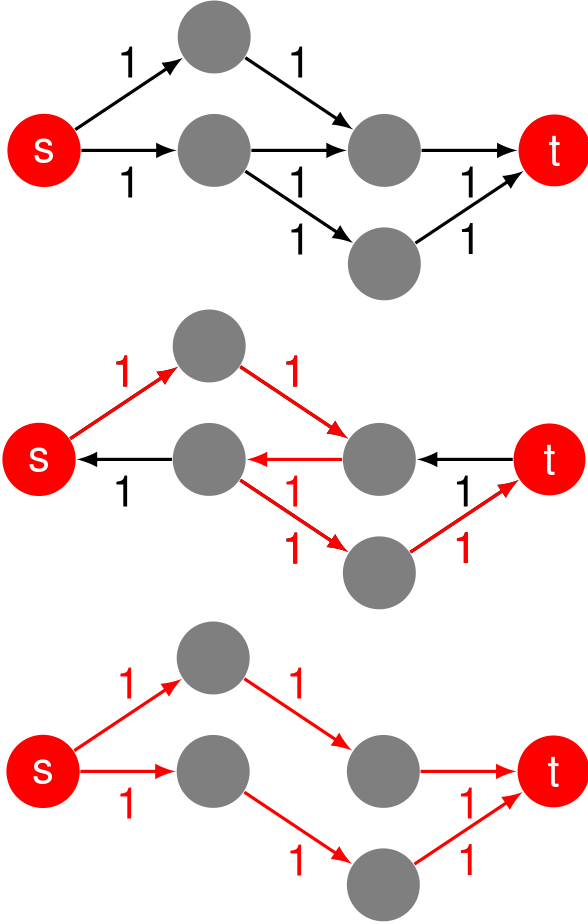
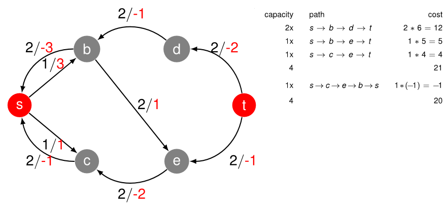

# Ford Fulkerson

Berechnent den maximalen Fluss in einem Graphen von einer Quelle $s$ zu einem Ziel $t$.

Idee:
    Füge rückwärts-gerichtete Kanten ein, welche es ermöglichen andere Pfade (teilweise) rückgängig zu machen. Dies wird auch asl "Residual Graph" bezeichnet.

## Algo

Gegeben:
    $G(V,E)$ mit positiven Kapazitäten $\omega: E \rightarrow \mathbb{R}$, Quelle $s$, Ziel $t$.

Finde:
    Maximalen Fluss $F_{s \rightarrow t}$ von $s$ zu $t$ durch $G$

Start:
    Setze den totalen Fluss $F_{s \rightarrow t} = 0$, den Residualgraph $G_{R}=G$ und die Kantenflüsse $f(e) = 0, \forall e \in E$

1. Solange ein Pfad $P$ von $s$ zu $t$ in $G_{R}$ existiert:
   1. Finde die kleinste Kapazität $g_{min}$ auf dem Pfad $P$
   2. Reduziere die Kapazitäten auf $P$ um $g_{min}$
   3. Erhöhe die Kapazitäten auf den rückwärtigen Kanten auf Pfad $P$ um $g_{min}$
      1. Existiert für eine Kante $e$ auf dem Pfad $P$ keine rückwartige Kante $\bar{e}$, füge eine hinzu
   4. Entferne Kanten mit Kapazität $0$ in $G_{R}$
   5. Erhöhe $F_{s \rightarrow t}$ um $g_{min}$
   6. Erhöhe den Kantenfluss $f(e)$ von $P$ um $g_{min}$
2. Notiere das Resultat $F_{s \rightarrow t}, f(e), e \in E$

## Min-Cost Max-Flow Algorithmus

Dies ist eine Erweiterung des [Ford Fulkerson](./FordFulkerson) Algorithmus, welcher zusätzlich zum maximalen Flow noch die Kosten berechnet

1. Stelle den Graphen wie bei Ford-Fulkerson auf
2. Für jede Kante, notiere das Gewicht neben der Kapazität
3. Berechne den Maximalen Fluss gemäss Ford Fulkerson mit folgenden Anpassungen
   1. Für jede rückwärts gerichtete Kante die eingefügt wird, notiere das __negative__ Gewicht neben der Kapazität.
   2. Berechne die Kosten für jeden Pfad $P$ wie folgt:
      1. Addiere alle Kosten auf dem Pfad
      2. Multipliziere diese mit der Kapazität $g_{min}$ des Pfades
   3. Addiere alle Kosten der Pfade zusammen.
4. Nach Beendigung von Ford-Fulkerson
   1. Prüfe ob der residuale Graph $G_{R}$ noch Zyklen mit negativen Kosten hat.
   2. Falls ja, subtrahiere diese Kosten von den Gesamtkosten.

