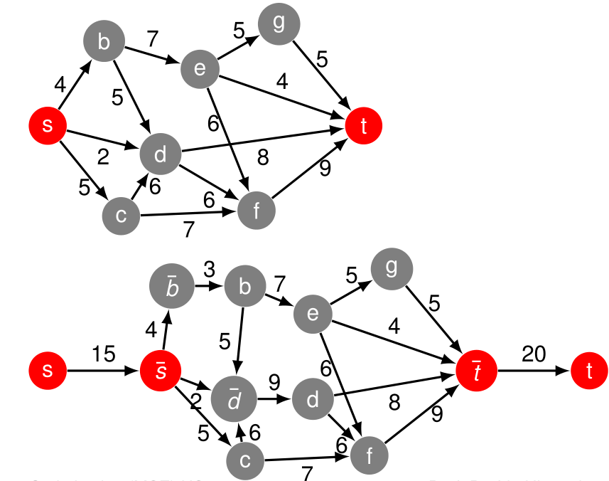

# Edmonds-Karp Algorithm

Der Edmond-Karps Algorithmus findet einen 

## Algo

1. Ein Vertex $x$ hat eine Beschränkung auf um $g$
   1. Füge einen Vertex $\bar{x}$ ein
   2. Entferne alle eingehenden Kanten von $x$ und übertrage diese auf $\bar{x}$
   3. Füge eine Kante $E(\bar{x},x)$ mit Gewicht $g$ ein.
2. Der Quellvertex $s$ hat eine Beschränkung um $g$
   1. Füge einen Vertex $\bar{s}$ ein.
   2. Füge eine Kante $E(\bar{s},s)$ mit Gewicht $g$ ein.
   3. Setzte $\bar{s}$ als neuen Quellvertex.
3. Der Zielvertex $t$ hat eine Beschränkung um $g$
   1. Füge einen Vertex $\bar{t}$ ein.
   2. Füge eine Kante $E(t,\bar{t})$ mit Gewicht $g$ ein.
   3. Setzte $\bar{t}$ als neuen Zielvertex.

