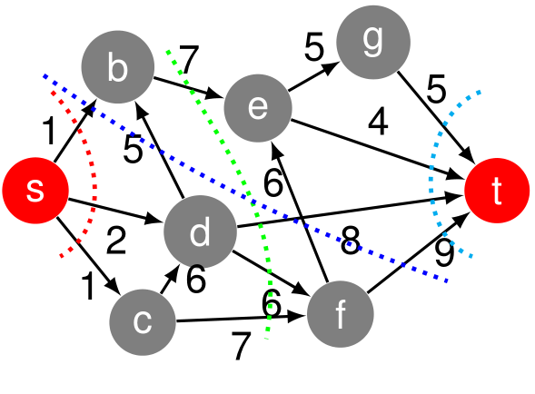

# Max-Flow Min-Cut Theorem

Definition:
    Ein _st_-__cut__ in einem Graphen $G(V,E)$ ist eine Teilung des Vertex-Set $V$ in zwei Sets $S$ und $T = V \setminus S$, mit $s \in S, t \in T$. Der __Wert$$ eines solchen _st_-__cut__ ist das totale Gewicht aller Kanten welche von $S$ nach $T$ gehen

Max-Flow Min-Cut Theorem:
    Der maximale _st_-Fluss entspricht dem minimalen WErt von allen (exponentiel vielen!) möglichen _st_-__cut__s.

\newpage