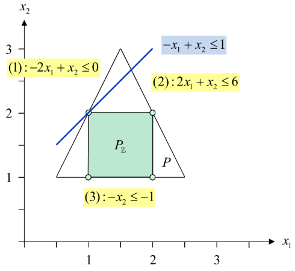

# Cutting Planes

Berechnet eine Linearisierung für ein LP-Problem.

## Algo

Given a linear program in inequality form.

1. Assign an index number to each inequality
2. Identify your target inequalities
   1. Look at your graphic and write down an inequality for each new line you have to draw.
      - This will probably be something simple like $x_{1} \leq 1$
3. Determine which source equalities will net you a new target equality
   1. For each point of your target equality, take the source equalities that intersect with it.
4. Write down a System of linear equations of only the two resulting equalities
5. Combine them in a way, that nets you the target inequality
   1. Remember that you can't have fractionals. These have to be floored in the final step.

\newpage