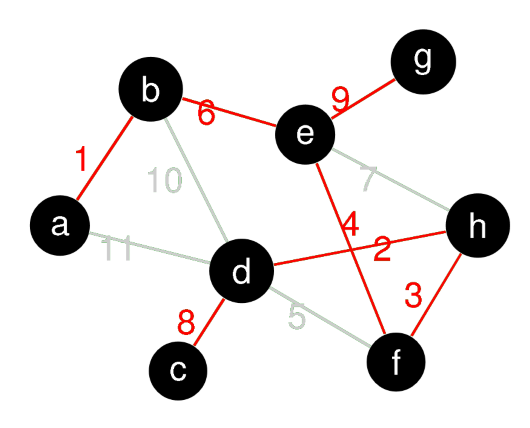

# Kruskals Algorithm

Für einen gegebenen Graphen $G(V,E)$ mit positiven Kantengewichten:
    Finde ein Set aus Kanten, welche alle Vertices von G verbinden und ein minimales Totalgewicht haben.

## Algo

1. Setzte $M=\{\}$
2. Wähle die Kante $e$ aus allen Kanten $V$, mit dem kleinsten Gewicht, aus.
3. Sind die Vertices von $e$ noch nicht in $M$, füge diese zu $M$ hinzu.
4. Ansonsten, verwerfe $e$ und wähle die nachstgünstigere Kante aus.
5. Ist $V=M$, STOP.

## Hinweise

- Kruskal ist ein Greedy-Algorithmus
- Kruskal ist equivalent zum [Optmistischen Ansatz](./SpanningTrees/OptimistischerAnsatz)