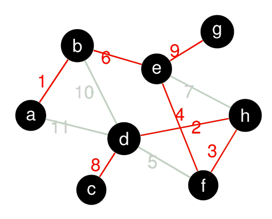

# Spanning Trees

Für einen gegebenen Graphen $G(V,E)$ mit positiven Kantengewichten:
    Finde ein Set aus Kanten, welche alle Vertices von G verbinden und ein minimales Totalgewicht haben.

## Optimistischer Ansatz

1. Sortiere alle Kanten **aufsteigend** nach Gewicht
2. Iteriere
   1. Nimm das kleinste Gewicht aus der Liste
   2. Ist dieses nicht redundant, füge dieses zu den aktiven Kanten hinzu
   3. Stoppe, wenn keine Kanten mehr hinzugefügt werden können

## Pesimistischer Ansatz

1. Sortiere alle Kanten **absteigend** nach Gewicht
2. Iteriere
   1. Nimm das grösste Gewicht aus der Liste
   2. Ist dieses redundant, entferne es aus der Liste
   3. Stoppe, wenn keine Kanten mehr entfernt werden können