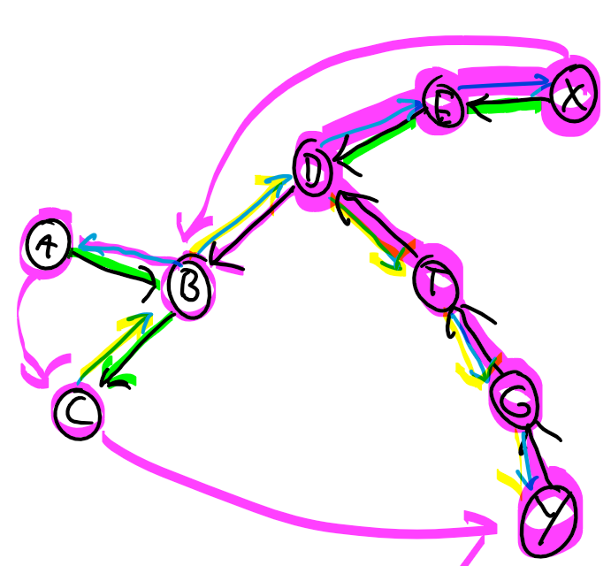

# Traveling Salesman Problem MST-Based Heuristic

MST:
    MST steht für minimum spanning tree

## Algo

Initialisierung:

1. Für den Graphen $G$, konstruiere einen Minimalen Spanningtree
2. Dupliziere jede Kante und konvertiere diese in gerichtete Kanten mit entgegengesetzten Richtungen
3. Wähle einen Startknoten $s$ aus.

Iteriere:

Für den aktuellen Knoten s, besuchen jeden Nachbar wie folgt:

1. Besuche noch nicht besuchte Knoten zuerst
2. Hat ein Knoten nur bereits besuchte Nachbaren, nimm eine Abkürzung zum nächsten unbesuchten Knoten indem man den ungebrauchten Kanten folgt
3. Stoppe, sobald alle Kanten benutzt wurden und du zurück bei $s$ bist.

